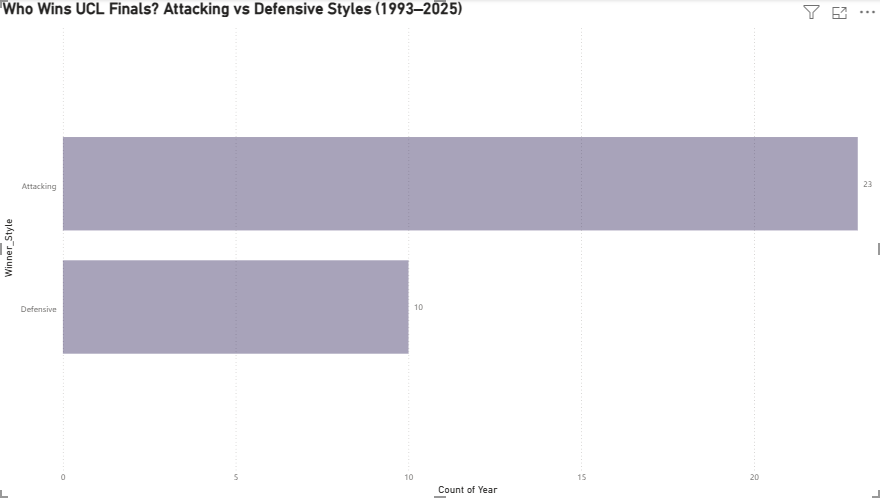
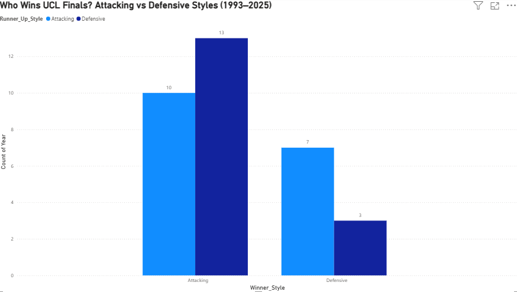
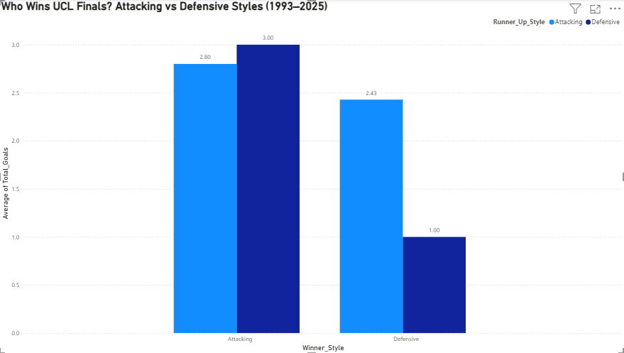

# Style Makes Fights — UCL Finals Analysis (1993–2025) and what it says about PSG vs Arsenal

> *"Arsenal don't need to beat PSG. They just need to make it ugly."*

A data-driven breakdown of every Champions League final since 1993 — built in Power BI to answer one question: **does attacking brilliance beat defensive solidity, or does it just think it does?**

Published ahead of the 2026 UCL Final: **PSG vs Arsenal, May 30th, Budapest.**

---

## Dashboard Preview

### Chart 1 — Who wins UCL finals overall?


### Chart 2 — When defensive meets attacking, who wins?


### Chart 3 — Average goals per final by style matchup


---

## The Question

PSG are the defending champions — electric, attacking, relentless. Arsenal are built on one of the most elite defensive records in Champions League history. 33 years of finals data has something to say about this matchup.

---

## Findings

| Matchup | Result | Times |
|---|---|---|
| Attacking beats Attacking | Attacking wins | 13 |
| Attacking beats Defensive | Attacking wins | 10 |
| Defensive beats Attacking | Defensive wins | 7 |
| Defensive beats Defensive | Defensive wins | 3 |

**The headline number: defensive teams beat attacking teams 7 out of 17 times — a 41% win rate.**

That's not an upset. That's a coin flip with a slight lean.

### Average goals when defensive teams win
When a defensive team beats an attacking team in a UCL final, the average scoreline is **2.43 goals.** Low scoring. Tight. Decided by one moment.

Arsenal's UCL campaign this season: **6 goals conceded in 14 games.** David Raya: **9 clean sheets** — equalling the all-time Champions League record.

They are built for exactly this.

---

## The Prediction a

**Data says:** PSG win 59% of the time historically in this matchup.

**But:** Arsenal's defensive numbers this season are historically elite. If they keep it to one or two goals, history gives them a genuine 41% chance.

Style makes fights. And Arsenal know exactly what style wins theirs.

---

## Tools & Data

| Tool | Purpose |
|---|---|
| Power BI Desktop | Dashboard and visualisation |
| Power Query | Data transformation |
| Manual research | UCL finals results 1993–2025 |

**Dataset built from:** Wikipedia UCL finals records + UEFA.com + manual style classification based on each team's goals scored/conceded that season.

---

## Repository Structure

```
ucl-finals-style-analysis/
│
├── UCL_Finals_Analysis.csv        # Full dataset — 33 finals, 10 columns
├── UCL_Finals_Dashboard.pbix      # Power BI file
├── chart1_overall_wins.png        # Attacking vs Defensive overall wins
├── chart2_styles_matchup.png      # Head to head style matchups
├── chart3_avg_goals.png           # Average goals by style matchup
└── README.md                      # You are here
```

---

## 👤 About

I grew up loving stories — then spent years in MPC, engineering, and networking chasing a living instead. A random seminar on AI and ML reignited everything. Turns out data is just storytelling with better evidence.

I'm Zubair Khan — a football obsessive turned data analyst, using visualisation tools to tell the stories the scoreline doesn't show. Follow along as this project grows through the world of football

🔗 [linkedin.com/in/zubair-khan-22080753](https://www.linkedin.com/in/zubair-khan-22080753)

---

## Read the Full Analysis

The full newsletter breakdown — with the complete prediction and historical precedents — is on my Beehiiv newsletter.

*🔗 [Beehiiv]*

---

*Data covers UEFA Champions League era finals only (1993–2025). Style classifications based on seasonal goals scored/conceded metrics and tactical setup.*
